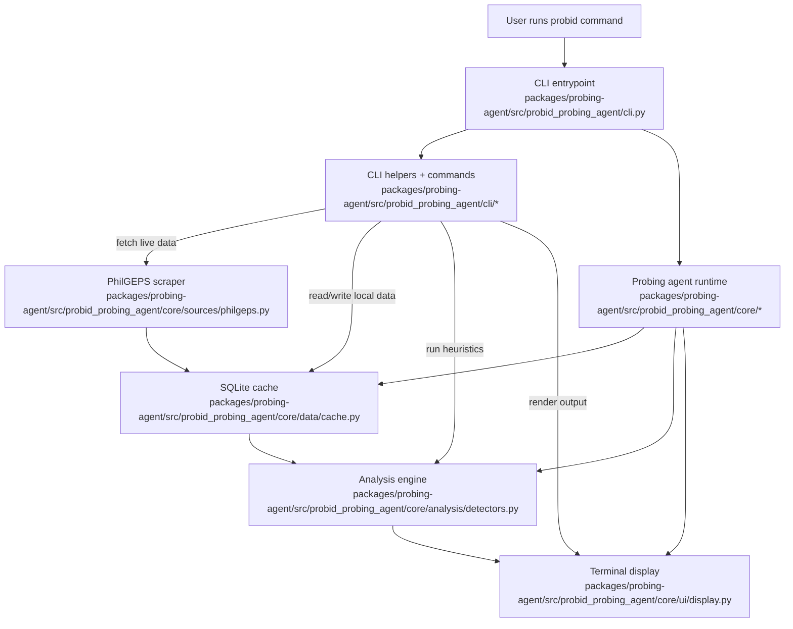

# probid

Minimal terminal probing agent harness for Philippine public procurement.

Minimal tool. Serious purpose.

- Local-first procurement scrutiny
- Explainable risk flags (not verdicts)
- Constrained, auditable agent steps
- RA 12009 + IRR baseline
- Minimal terminal default (`probid` opens the harness)

See `AGENTS.md` for agent-specific project guidance.

`probid` helps users run local-first, explainable procurement probes from the terminal. It searches PhilGEPS notices, inspects notice details, reviews contract awards, and surfaces reason-coded risk signals through a small set of constrained workflows.

Data source: [PhilGEPS](https://notices.philgeps.gov.ph/) (Philippine Government Electronic Procurement System).

## Features

- Probe data with summary-first, reason-coded findings (`probe`)
- Search procurement notices by keyword
- Fetch full notice details by reference number
- View recent contract awards
- Inspect supplier and agency activity from the local cache
- Detect possible overpricing, repeat awardees, supplier networks, and contract splitting
- Reuse a local SQLite cache to reduce scraping

## Install

```bash
uv sync
# For browser/scraper support (Linux/Mac/Windows):
# uv sync --all-extras
# playwright install chromium
```

## Tests

```bash
# Run the probing-agent package test suite
python3 scripts/run_tests.py

# Or use the shell wrapper
./test.sh

# Run a single contract test directly
PYTHONPATH=packages/probing-agent/src:packages/agent/src:packages/ai/src:packages/tui/src:packages/mom/src:packages/pods/src python3 -m unittest packages/probing-agent/tests/test_probe_output_contract.py -v
```

## Workspace commands

```bash
# Install dependencies
uv sync

# Show CLI help
probid --help

# Run the full active package test suite
python3 scripts/run_tests.py

# Open the interactive harness
probid
```

## Usage

```bash
# Open minimal terminal probing agent harness (default)
probid

# One-shot query mode (text)
probid -q "probe laptop"

# One-shot query mode with explicit provider
probid -q "probe laptop" --provider deterministic

# One-shot query mode (JSON)
probid -q "probe laptop" --json-output

# Open explicit agent harness shell (same REPL)
probid agent

# Open explicit agent harness shell with provider
probid agent --provider deterministic

# Enable local session logging (off by default)
PROBID_AGENT_LOG_SESSION=1 probid -q "probe laptop" --json-output

# Probe procurement data (summary-first)
probid probe "laptop"

# Probe with confidence filter
probid probe "laptop" --min-confidence medium

# Probe with capped findings
probid probe "laptop" --max-findings 3

# Probe with explainers (evidence + caveats)
probid probe "laptop" --why

# Probe as machine-readable JSON
probid probe "laptop" --json

# Search procurement notices
probid search "laptop"
probid search "server" --pages 3 --detail

# Fetch a specific notice
probid detail 12905086

# List contract awards
probid awards
probid awards --agency "DICT" --supplier "ACME"

# Supplier profile
probid supplier "ACME CORPORATION"

# Agency profile
probid agency "DICT"

# Detect overpricing
probid overprice "laptop" --threshold 150

# Find repeat awardees
probid repeat --min-count 3

# Supplier network analysis
probid network "ACME CORPORATION"

# Detect contract splitting
probid split "DICT" --gap-days 30

# List all agencies
probid agencies
```

Tip: use `--cache-only` on `probe`, `search`, and `awards` to query the local SQLite cache without scraping.

Tip: in interactive mode (`probid`), type `/prompt` to view the active agent system prompt.
Tip: `/tools` shows strict CLI-parity capabilities, and `/mode` prints runtime mode toggles.
Tip: use `/clear` to redraw the minimal terminal harness shell.

## Reason codes

`probe` findings use reason codes for explainability:

- R1: Repeat supplier concentration
- R2: Near-ABC award pattern
- R3: Potential split contracts in short interval
- R4: Procurement mode outlier frequency (excluding unknown mode labels)
- R5: Abnormal budget-utilization spread for similar category
- R6: Single-agency dependence risk (supplier)
- R7: Sparse/low-confidence data warning
- R8: Beneficial ownership disclosure gap (data unavailable locally)

`probe` summary also includes a data-quality gate:
- `adequate`: enough local volume for initial triage signal
- `limited`: use wider query/pages for stronger confidence
- `constrained`: very sparse local data; findings are low-confidence

## Packages

| Package | Purpose | Status |
|---|---|---|
| `packages/probing-agent/` | Interactive terminal probing agent CLI and current working app package | active |
| `packages/agent/` | Shared agent-core abstractions extracted and tested (28 tests) | extracted |
| `packages/ai/` | Future provider/model integration layer | experimental |
| `packages/tui/` | Future terminal UI primitives | experimental |
| `packages/mom/` | Future messaging/bot integrations | experimental |
| `packages/pods/` | Future infrastructure/model-pod helpers | experimental |
| `packages/web-ui/` | Future browser UI package | experimental |

Today, the main implementation lives in `packages/probing-agent/`. The `packages/agent/` package contains reusable runtime primitives extracted for future reuse.

## Project structure

`probid` follows a pi-mono-style packages layout, with Python packages organized by responsibility.

```text
probid
├── README.md
├── AGENTS.md
├── pyproject.toml
├── scripts
│   └── run_tests.py
└── packages
    ├── ai                     # AI client layer
    │   └── src/probid_ai
    ├── agent                  # reusable agent-core
    │   ├── src/probid_agent
    │   └── tests/
    ├── probing-agent          # main CLI app
    │   ├── src/probid_probing_agent
    │   └── tests/
    ├── tui                    # terminal UI components
    ├── web-ui                 # web UI rendering
    ├── mom                    # messaging/bot store
    └── pods                   # model pod management
```

## Packages

| Package | Purpose | Status | Tests |
|---------|---------|--------|-------|
| `probing-agent/` | Main CLI application | **active** | 30 |
| `agent/` | Reusable agent runtime primitives | extracted | 28 |
| `ai/` | AI client layer (OpenAI-compatible) | extracted | 6 |
| `tui/` | Terminal UI components | extracted | 13 |
| `web-ui/` | Web UI rendering | extracted | 15 |
| `mom/` | Messaging/bot store | extracted | 11 |
| `pods/` | Model pod management | extracted | 14 |

**Total: 117 tests passing**


## How the project works



### Responsibilities

- `packages/probing-agent/src/probid_probing_agent/cli.py` — thin Click entrypoint
- `packages/probing-agent/src/probid_probing_agent/cli/` — CLI helpers and command wiring
- `packages/probing-agent/src/probid_probing_agent/core/` — runtime, session, tools, planner, providers, procurement logic
- `packages/probing-agent/src/probid_probing_agent/modes/interactive/` — interactive harness mode
- `packages/agent/src/probid_agent/` — generic agent-core abstractions
- `packages/ai/src/probid_ai/` — future AI/provider integration layer
- `packages/tui/src/probid_tui/` — future terminal UI primitives

## Cache

Data is stored locally at:

```text
~/.probid/probid.db
```

Override the cache directory with:

```bash
export PROBID_CACHE_DIR=/path/to/cache-dir
```

## License

MIT
