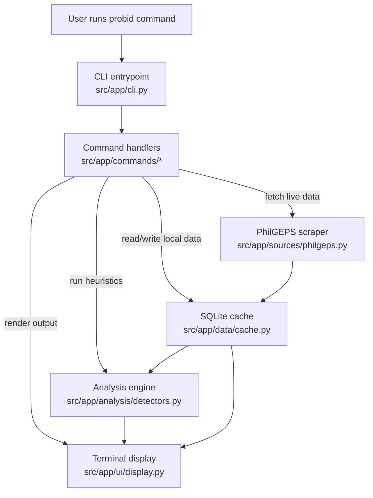

# probid

Probe Philippine government procurement.

`probid` helps you search PhilGEPS notices, inspect notice details, review contract awards, and run simple heuristics for suspicious procurement patterns.

Data source: [PhilGEPS](https://notices.philgeps.gov.ph/) (Philippine Government Electronic Procurement System).

## Features

- Search procurement notices by keyword
- Fetch full notice details by reference number
- View recent contract awards
- Inspect supplier and agency activity from the local cache
- Detect possible overpricing, repeat awardees, supplier networks, and contract splitting
- Reuse a local SQLite cache to reduce scraping

## Install

```bash
pip install -e .
playwright install chromium
```

## Usage

```bash
# Search procurement notices
probid search "laptop"
probid search "server" --pages 3 --detail

# Fetch a specific notice
probid detail 12905086

# List contract awards
probid awards
probid awards --agency "DICT" --supplier "ACME"

# Supplier profile
probid supplier "ACME CORPORATION"

# Agency profile
probid agency "DICT"

# Detect overpricing
probid overprice "laptop" --threshold 150

# Find repeat awardees
probid repeat --min-count 3

# Supplier network analysis
probid network "ACME CORPORATION"

# Detect contract splitting
probid split "DICT" --gap-days 30

# List all agencies
probid agencies
```

Tip: use `--cache-only` on `search` and `awards` to query the local SQLite cache without scraping.

## Project structure

The repo name remains `probid`, and the installed CLI command is still `probid`, but the internal Python package is now `app`.

```text
probid
├── README.md
├── pyproject.toml
└── src
    └── app
        ├── __init__.py
        ├── cli.py
        ├── commands
        │   ├── analysis.py
        │   ├── awards.py
        │   ├── profiles.py
        │   └── search.py
        ├── data
        │   ├── cache.py
        │   └── models.py
        ├── analysis
        │   └── detectors.py
        ├── sources
        │   └── philgeps.py
        └── ui
            └── display.py
```

## How the project works



### Responsibilities

- `src/app/cli.py` — thin Click entrypoint
- `src/app/commands/` — CLI commands grouped by feature
- `src/app/data/` — cache access and typed models
- `src/app/analysis/` — anomaly detection and analysis logic
- `src/app/sources/` — external data connectors and scrapers
- `src/app/ui/` — Rich terminal rendering

## Cache

Data is stored locally at:

```text
~/.probid/probid.db
```

Override the cache directory with:

```bash
export PROBID_CACHE_DIR=/path/to/cache-dir
```

## License

MIT
